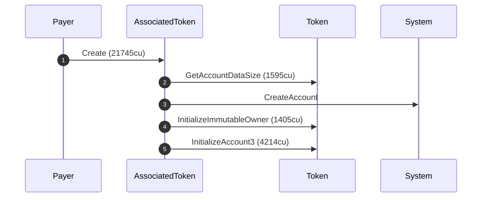
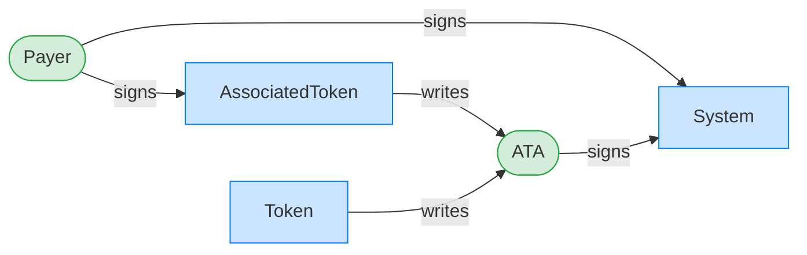
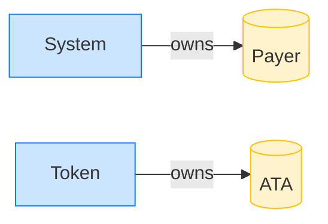

# Create an associated token account

**Intent.** Create the payer's ATA; the program allocates the account through System and initializes it through Token, so the tree nests both CPIs.

**Outcome.** The transaction succeeded.

**Source.** [`tests/report.rs::ata_create`](../tests/report.rs#L109)

## Structured execution log

```
CPI Tree (21,745 BPF CU / 1,400,000 budget):
└── (21,745 / 1,400,000 CU) AssociatedToken
    │ >> log:  Create
    │ >> log:  Initialize the associated token account
    ├── GetAccountDataSize (1,595 / 1,393,109 CU) Token
    │     >> log:  Program return: TokenkegQfeZyiNwAJbNbGKPFXCWuBvf9Ss623VQ5DA pQAAAAAAAAA=
    ├── CreateAccount System
    ├── InitializeImmutableOwner (1,405 / 1,386,604 CU) Token
    │     >> log:  Please upgrade to SPL Token 2022 for immutable owner support
    └── InitializeAccount3 (4,214 / 1,382,773 CU) Token
```

## Sequence diagram



## Authority graph

Who signed for what; an `invoke_signed` PDA appears as its own authority.



## Ownership graph

Which program owns each account the transaction wrote.


