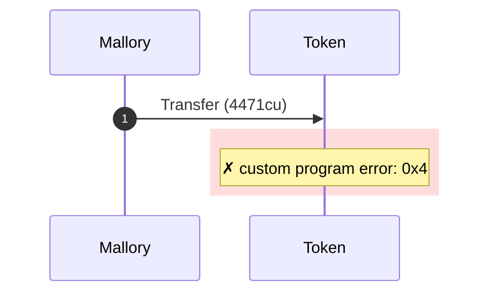
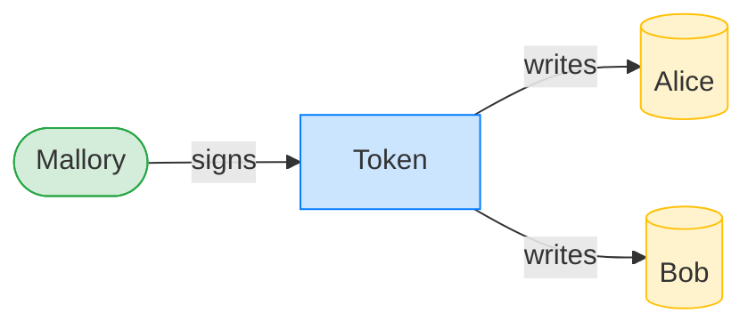
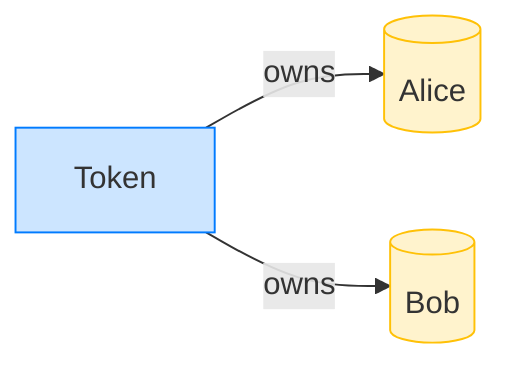

# Reject a transfer signed by the wrong authority

**Intent.** Mallory signs a transfer of Alice's tokens; the token program rejects it because Alice is owned by someone else.

**Outcome.** The transaction failed: `custom program error: 0x4`.

**Source.** [`tests/report.rs::token_transfer_rejects_wrong_authority`](../tests/report.rs#L97)

## Structured execution log

```
CPI Tree (4,471 BPF CU / 1,400,000 budget):
└── Transfer FAILED: custom program error: 0x4 (4,471 / 1,400,000 CU) Token (no CPIs)
      >> log:  Error: owner does not match
```

## Sequence diagram



## Authority graph

Who signed for what; an `invoke_signed` PDA appears as its own authority.



## Ownership graph

Which program owns each account the transaction wrote.


