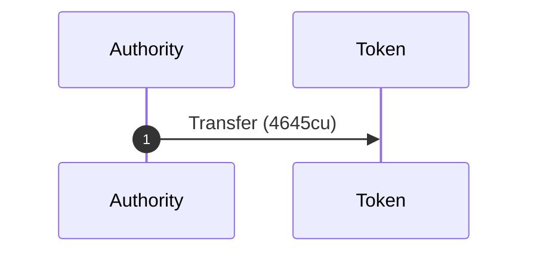
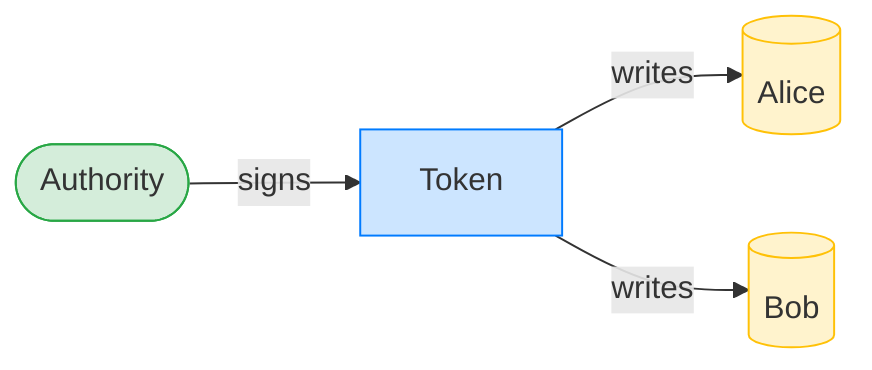
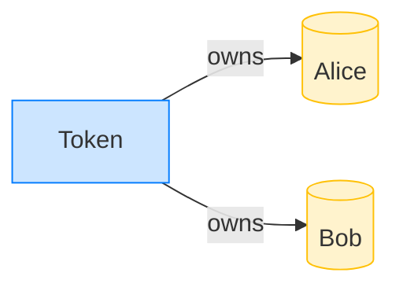

# Transfer SPL tokens

**Intent.** Move 100 tokens from Alice to Bob; the owning authority signs.

**Outcome.** The transaction succeeded.

**Source.** [`tests/report.rs::token_transfer`](../tests/report.rs#L87)

## Structured execution log

```
CPI Tree (4,645 BPF CU / 1,400,000 budget):
└── Transfer (4,645 / 1,400,000 CU) Token (no CPIs)
```

## Sequence diagram



## Authority graph

Who signed for what; an `invoke_signed` PDA appears as its own authority.



## Ownership graph

Which program owns each account the transaction wrote.


